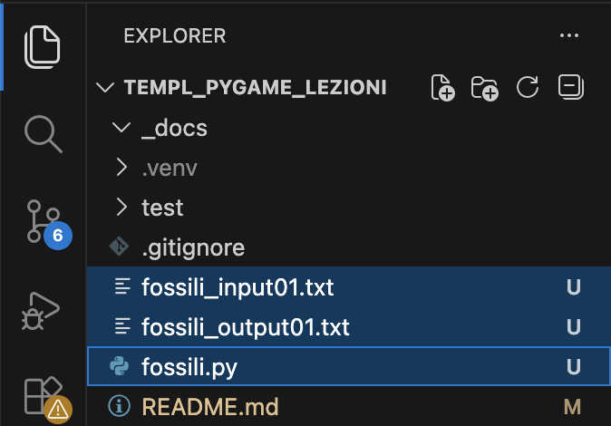

[](https://classroom.github.com/online_ide?assignment_repo_id=22204369&assignment_repo_type=AssignmentRepo)
# Sezione Olimpiadi di Informatica

## Preparazione ambiente per il singolo problema
Prepariamo ad esempio l'ambiente per risolvere il problema "Fossili"
### Apriamo la pagina del problema
- Login su [training.olinfo.it](https://training.olinfo.it)
- Click su: Risolvi i problemi / Territoriali
- Cercare "fossili" / Click "Antichi fossili"

**Prima ancora di leggere e comprendere il problema**, prepariamo l'ambiente di sviluppo.
### Prepariamo l'ambiente
- Dalla pagina del problema "Antichi fossili", scaricare il template python "fossili.py" nella cartella principale di questo progetto.
- Aprire fossili.py
- Attivare le righe relative a sys.stdin e sys.stdout (eliminare il commento '#')
- Modificare "input.txt" --> "fossili_input01.txt"
Il template modificato dovrebbe apparire quindi:
```python
import sys
import os
# se preferisci leggere e scrivere da file
# ti basta decommentare le seguenti due righe:
sys.stdin = open('fossili_input01.txt')
sys.stdout = open('output.txt', 'w')
...
```
- Creare nella cartella principale del progetto due file vuoti: fossili_input01.txt, fossili_output01.txt


- Copiare la sezione **Input** del testo del problema nel file **fossili_input01.txt**
- Copiare la sezione **Output** del testo del problema nel file **fossili_output01.txt**
- Quindi il file **fossili_input01.txt** conterrà:
```text
2

15 43
20 500
7 30

70 100
70 100
70 100
```
ed il file **fossili_output01.txt** conterrà:
```text
Case #1: 10
Case #2: 30
```
In definitiva, abbiamo impostato il template in modo tale che gli input saranno letti dal file **fossili_input01.txt** ed i risultati saranno scritti nel file **output.txt**.

Per meglio comprendere il funzionamento del template, consiglio di lanciare il **debugger** (breakpoint sulla prima istruzione, click su fossili.py / opzioni tasto run ▶️ / debug) ed eseguire il template una istruzione per volta.

A questo punto siamo pronti per risolvere il problema. Quello che resta da fare è analizzare l'esercizio e scrivere il proprio programma sostituendo **solo queste righe** presenti nel template
```python
# aggiungi codice...
risposta = 42
```
- Eseguire il programma: click su fossili.py / tasto run ▶️ in alto a destra.

Solo quando il programma che scriveremo genererà un file **output.txt** identico al file **fossili_output01.txt**, con buone probabilità la nostra soluzione risulterà corretta e saremo quindi pronti per caricare la soluzione su training.olinfo.it!

- Per sottoporre il problema seguire le istruzioni della piattaforma. Per la maggior parte dei casi, prima del caricamento della soluzione bisogna disattivare la lettura e scrittura su file, quindi:
```python
...
# sys.stdin = open('fossili_input01.txt')
# sys.stdout = open('output.txt', 'w')
...
```
In altri casi la piattaforma generetà un file di input da scaricare e richiederà anche il file di output, quindi:
```python
...
sys.stdin = open('input_generato_dalla_piatta.txt')
sys.stdout = open('output.txt', 'w') #output.txt da caricare insieme al sorgente.
...
```


### Prima di chiudere l'ambiente di sviluppo
- Per salvare il lavoro, click su Source Control / Message + Commit & Push
- Al termire, effettuare il Logout da Visual Studio Code / GitHub

### Accedere ad altri esercizi
- Login su [training.olinfo.it](https://training.olinfo.it)
- Click su: Risolvi i problemi
  - Nazionali, OIS: qui i problemi sono raggruppati per difficoltà
  - Territoriali
- Click su: Algobadge, apprendimento guidato
- Wiki, Forum: soluzioni e supporto ad alcuni problemi in piattaforma

<hr/>

# Sezione Pygame

## Installazione librerie
- Aprire il terminale
- Eseguire:
```bash
pip install pygame pymunk
```

## Eseguire il test
- Selezionare test/test_pymunk.py
- Premere il tasto run ▶️ in alto a destra
- Dei Click nella finestra generano delle sfere soggette alla forza di gravità
